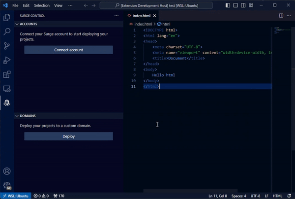

# Surge Volt  

🚀 Integration of the Surge static web publishing tool into Visual Studio Code, enabling users to deploy projects directly from the editor.

## Features

- **Install Surge:** Easily install Surge from within VS Code.
- **Deploy Projects:** Deploy new projects or update existing domains with ease.
- **Manage Domains:** View, refresh, and delete your deployed domains.
- **Account Management:** Connect, refresh, and manage multiple Surge accounts.

## Requirements

- **Node.js** must be [installed](https://nodejs.org/en/download/) on your machine.
- **Surge** must be installed, or it can be installed via the extension.

## Commands
| Command | Description |
|---|---|
| Surge Volt: Install Surge | Installs Surge on your machine. (only required if Surge is not already installed) |
| Surge Volt: Deploy | Deploys your project to a custom domain. |
| Surge Volt: Deploy on this domain | Deploys your project on the specified domain. |
| Surge Volt: Refresh Domain List | Refreshes the list of your Surge domains. |
| Surge Volt: Open Domain | Opens the selected domain in your default browser. |
| Surge Volt: Delete Domain | Deletes the selected domain from Surge. |
| Surge Volt: Refresh Account List | Refreshes the list of your Surge accounts. |
| Surge Volt: Delete Account | Deletes the selected Surge account. |
| Surge Volt: Connect Account | Connects to the specified Surge account. |
| Surge Volt: Connect New Account | Connects to a new Surge account. |
| Surge Volt: Disconnect Account | Disconnects the currently connected Surge account. |

## Contributing and Feedback
If you would like to contribute to this extension, please feel free to submit a pull request. If you have any feedback or suggestions, please feel free [to open an issue](https://github.com/Patzi275/surge-volt/issues/new/choose).

## License
This extension is licensed under the [MIT License](LICENSE).

<!-- ## Extension Settings

This extension contributes the following settings:

- `surge-volt.surge:installed`: Checks if Surge is installed.
- `surge-volt:ready`: Indicates if the extension is ready for use.
- `surge-volt:no-account`: Indicates if there are no connected accounts. -->

<!-- ## Known Issues

- Users may encounter issues if Surge is not installed properly.
- Authentication failures might require manual re-entry of credentials. -->

## Release Notes

### 0.0.1

- Initial release of Surge Volt.
- Basic domain management and deployment functionality.
- Account management features.

**Enjoy!**